<!-- Global style -->
<style>
h1 {
  color: #67EA94;
}
</style>

<style>
  img[alt~='center'] {
    display: block;
    margin-left: auto;
    margin-right: auto;
  }
</style>

<!-- footer:  Link para esta apresentação: [https://tmedicci.com.br/toscobreak/](https://tmedicci.com.br/toscobreak/) -->

<style>
footer {
    display: flex;
    align-items:center;
}
</style>


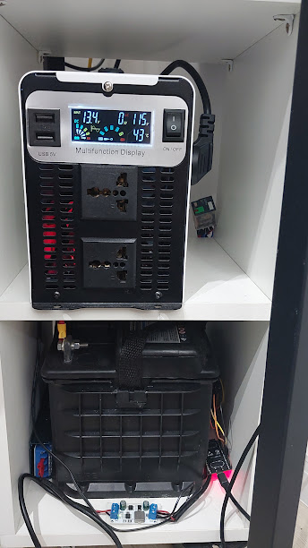

# TOSCOBREAK

**Construindo seu próprio No-Break**

*Parece chique? (Não é!)*

---

## LHC? :thinking:


O Laboratório Hacker de Campinas é *"hackerspace de Campinas que fornece um espaço aberto e comunitário para que entusiastas de tecnologia possam desenvolver seus projetos em áreas como eletrônica, robótica, mecânica, computação..."* (de [lhc.net.br](https://lhc.net.br))

Gostou? Faça uma doação (pix: batman@lhc.net.br) ou torne-se associado!

---

## Motivação :house:

- Servidor Proxmox rodando VMs e containers:
  - GitLab, Home Assistant, Pi-Hole, Plex etc
- Roteadores, Modem, Access Points...
- **Home-office**

**O problema:** uma queda de energia = reunião cai, trabalho perdido, servidor reiniciando do nada...

> *"Preciso de um nobreak. Mas qual?"*

---

## UPS "Profissional": Prós :white_check_mark:

A solução "fácil": comprar um **nobreak pronto**

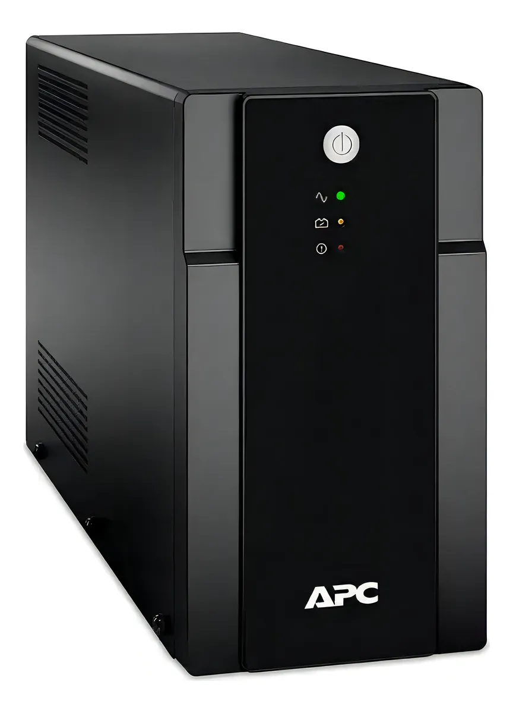

- Plug-and-play
- Certificado e testado
- Funciona imediatamente
- Garantia de fábrica

---

## UPS "Profissional": Contras :x:

Mas...

| Problema | Detalhe |
|----------|---------|
| 💰 Preço | R$ 800 ~ R$ 3.000+ |
| 🔋 Bateria | Substituição cara e trabalhosa |
| ⚡ Autonomia | Geralmente 10~20 min apenas |
| 🔒 Fechado | Sem controle / monitoramento extra |
| 📦 Qualidade | Bateria de chumbo-ácido genérica |

---

## Por que DIY? :wrench:

- 📚 **Aprendizagem**: entender o que está dentro da caixa
- 🔧 **Flexibilidade**: adaptar para a minha necessidade
- 🛠️ **Manutenção fácil**: troca componente a componente
- 💸 **Custo controlado**: compra só o que precisa
- 📊 **Integração**: Home Assistant, MQTT, dashboards
- 🔋 **Mais autonomia**: escolho a bateria que quiser!

> Spoiler: deu trabalho. Mas valeu! 😅

---

## O Sistema: Visão Geral :globe_with_meridians:

```
┌─────────────┐     ┌──────────────────┐
│  Rede 110V  │───▶│  Relé Schneider  │────▶ Equipamentos
└─────────────┘     └──────────────────┘
                             ▲
                    ┌────────┴─────────┐
                    │  Inversor 3000W  │
                    └────────▲─────────┘
                             │
                    ┌────────┴─────────┐
                    │ Bateria 12V 40Ah │
                    └────────▲─────────┘
                             │
               ┌─────────────┴──────────┐
               │  Carregador MPPT + 24V │
               └────────────────────────┘

    PZEM-017 + ESP32 Tasmota ──▶ Home Assistant
```

---

## Componente #1: Inversor de Potência

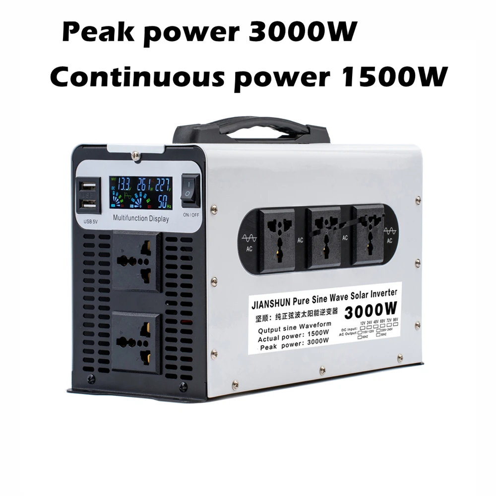

**Inversor Onda Senoidal Pura 3000W**

- DC **12V** → AC **110V**
- Onda senoidal **pura** (seguro para qualquer carga!)
- Display LED de status
- ~**R$ 680**

🔗 [Aliexpress — ADCFiber Store](https://pt.aliexpress.com/item/1005007210458610.html)

---

## Componente #2: Bateria

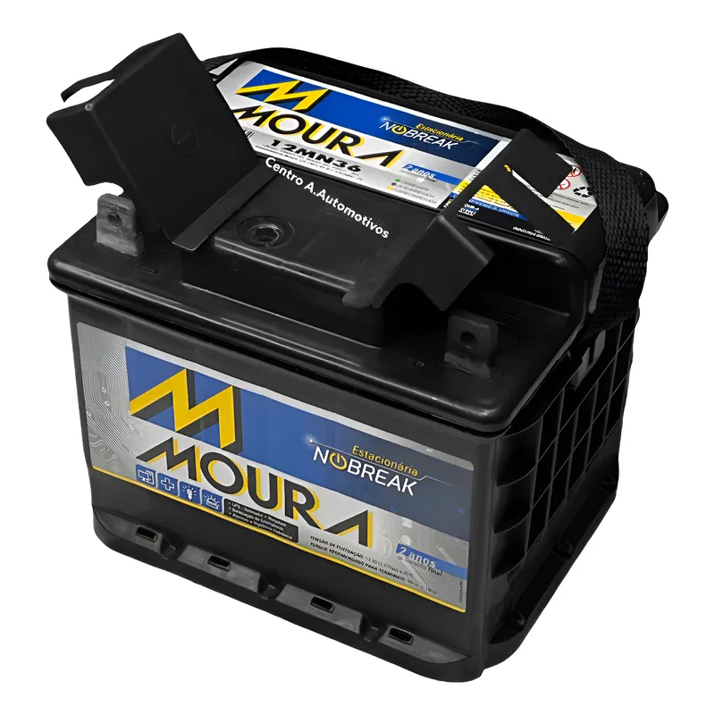

**Bateria Estacionária Moura 40Ah**

- 12V / **40Ah** (C120)
- VRLA (selada, sem manutenção)
- Marca nacional, **garantia 24 meses**
- ~**R$ 399**

🔗 [Mercado Livre — Centro A Baterias](https://www.mercadolivre.com.br/nobreak-bateria-estacionaria-moura-36ah-40ah-offgrid-solar/up/MLBU747860861)

---

## Componente #3: Carregador MPPT

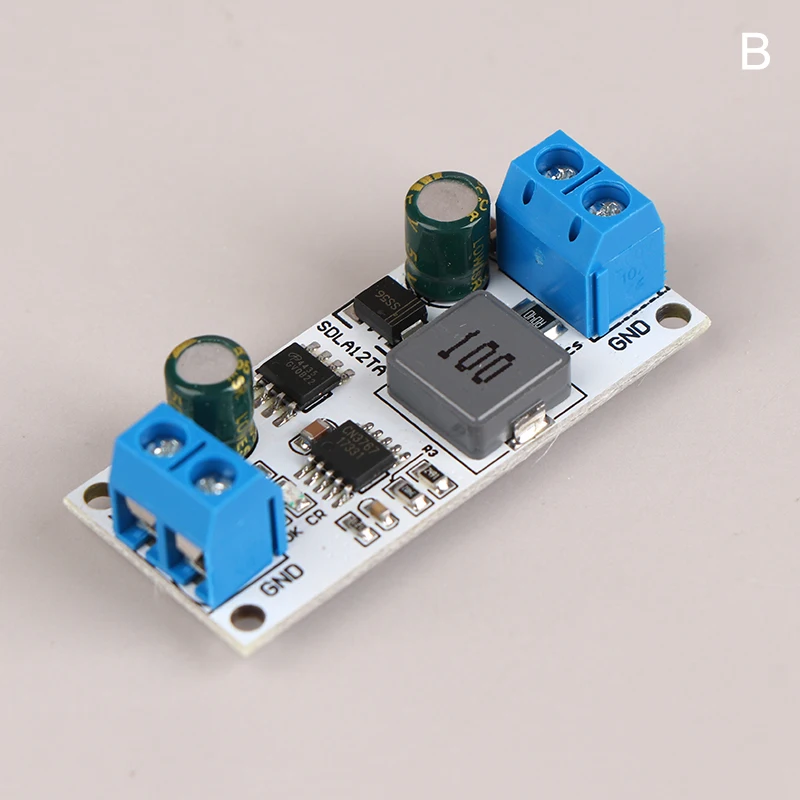

**Módulo MPPT SDLA12TA**

- Carregador para bateria **12V** (1~1000Ah)
- Tensão e corrente de carga regulada automaticamente
- Alimentado pela **fonte 24V**
- ~**R$ 33**

🔗 [Aliexpress — FaFa LaiCai Store](https://pt.aliexpress.com/item/1005010500683342.html)

---

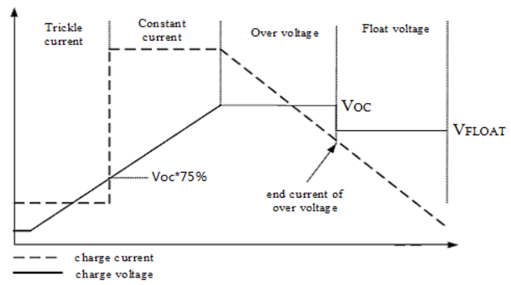

**Módulo MPPT SDLA12TA**

- Baseado no CI CN3767
- Curva de carga específica para baterias chumbo-ácido

🔗 [Datasheet - CN3767](https://www.alldatasheet.com/datasheet-pdf/download/1133236/CONSONANCE/CN3767.html)

---

## Componente #4: Fonte 24V

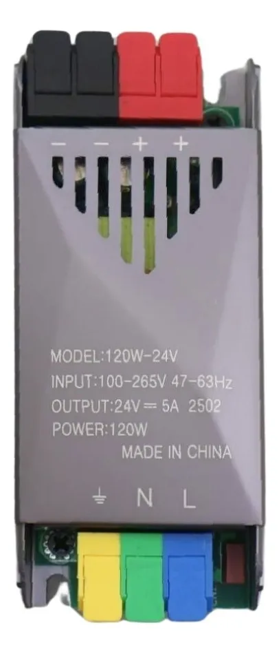

**Fonte 24V 5A 120W**
*Alimenta o módulo de carregamento MPPT*

- Bivolt 110/220V → 24V DC
- 120W de potência, perfil compacto
- ~**R$ 36**

🔗 [Mercado Livre — GoldenSky](https://www.mercadolivre.com.br/fonte-driver-de-presso-perfil-24v-5a-120w-para-fita-led-cob/p/MLB51241325)

---

## Componente #5: Relé de Chaveamento

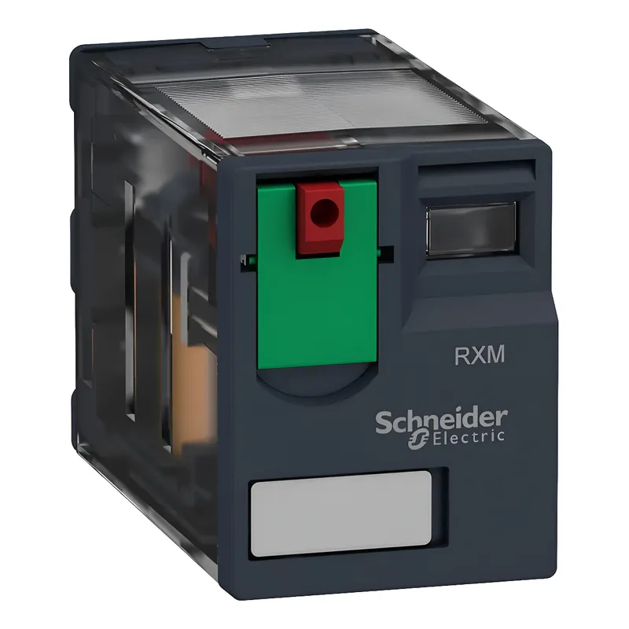

**Relé Schneider RXM2AB1F7**
*Chaveia entre rede elétrica e inversor*

- 12A, 2 contatos, 120VAC
- Qualidade industrial (Schneider Electric)
- Base dedicada para montagem em trilho DIN
- ~**R$ 80** + base ~**R$ 30**

🔗 [Mercado Livre](https://www.mercadolivre.com.br/rxm2ab1f7-rele-de-interface-12a-2naf-botao-de-teste-120vca/up/MLBU3572008076)

---

## Componente #6: Monitoramento DC

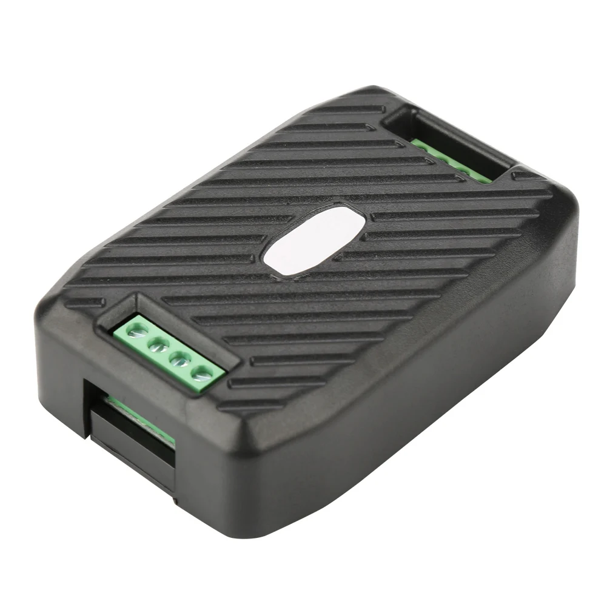

**PEACEFAIR PZEM-017**
- Mede tensão, corrente e potência DC
- Comunicação **RS485/Modbus**
- ~**R$ 41**

---

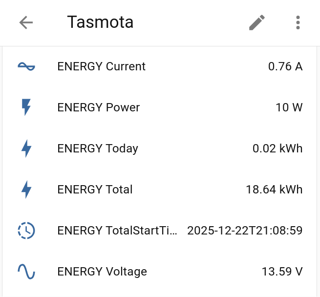

Usado com **ESP32 + firmware Tasmota**:
- Conversor DC-DC **12V→5V** para o ESP32 (~R$ 7)
- Reporta via **MQTT** para o Home Assistant 📊
- Monitoramento e controle.
---

## Funcionamento do Sistema :zap:

**Operação normal** (com energia da rede):
1. Rede 110V alimenta os equipamentos diretamente via relé
2. Fonte 24V + carregador MPPT mantém a bateria sempre carregada

**Nobreak como redundância (e não fonte primária)!**

---

**Operação em UPS** (falta de energia):
1. Relé detecta a ausência de tensão e comuta para o inversor
2. Inversor (continuamente ligado) converte **12V da bateria → 110V AC**
3. Equipamentos continuam funcionando! ✅

O **PZEM-017** monitora o barramento DC continuamente:
- Tensão, corrente e potência em tempo real no Home Assistant 📊
- Automação: se a tensão na bateria for menor que 11,6V, desliga a carga principal (Home-Lab)

---

## Monitoramento: Evento de Falta de Energia 📊

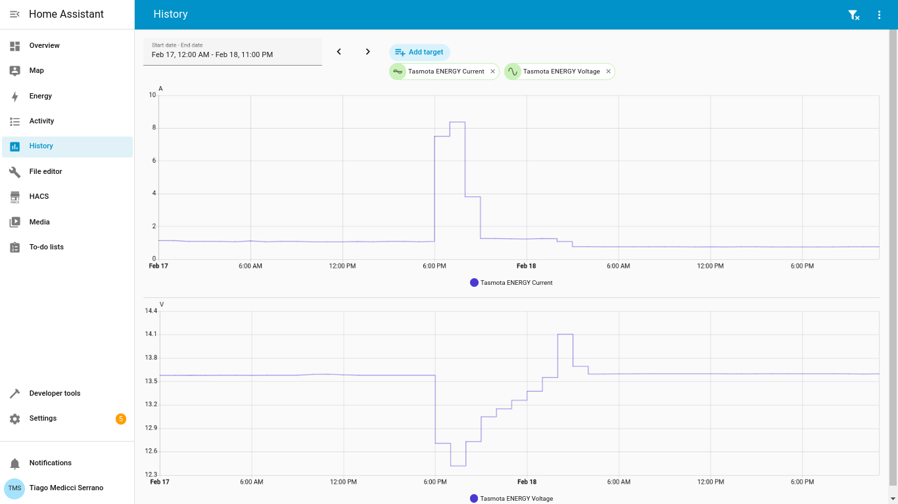

---

## Controle: Desligamento da Carga Principal 📊

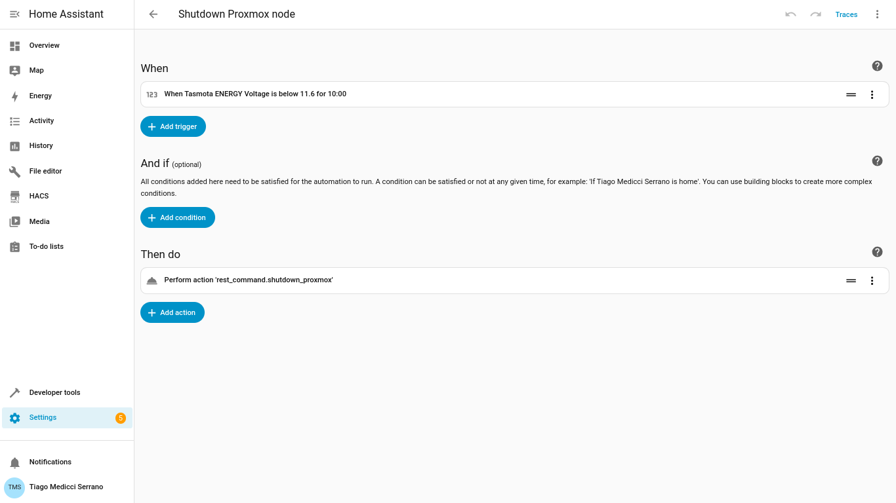

---

## Resultado: Servidor Não Caiu! :tada:

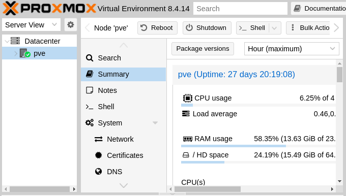

*Uptime do servidor Proxmox — sobreviveu às quedas de energia!*

---

## Gastos do Projeto :moneybag:

| Componente | Onde | Custo Est. |
|------------|------|-----------|
| Inversor 3000W onda senoidal | Aliexpress | R$ 680 |
| Bateria Moura 40Ah | Mercado Livre | R$ 399 |
| Carregador MPPT | Aliexpress | R$ 33 |
| Fonte 24V 120W | Mercado Livre | R$ 36 |
| Relé Schneider + Base | Mercado Livre | R$ 110 |
| PZEM-017 + Conversor DC-DC | Aliexpress | R$ 48 |
| **Total** | | **~R$ 1.306** |

> UPS similar pronto: R$ 1.500~3.000+ com **metade** da autonomia!

---

## Onde e Como Comprar :shopping_cart:

**AliExpress** *(carregador, PZEM, conversor DC)*
- Aguardar promoções (11/11, aniversário)
- Cupons de primeiro pedido na loja
- Atenção às taxas de importação (REMESSA CONFORME)

**Mercado Livre** *(inversor, bateria, fonte, relé)*
- Usar **cupons no app** (aba "Cupons")
  - Grupo de cupons no Telegram: diariamente, de 10% a 30%.
- Deixar carrinho pronto para só aplicar o cupom.

💡 *Bateria: verificar entrega. Evitar recondicionadas!*

---

## Referências :books:

<iframe height="800" src="https://www.youtube.com/embed/x1elMvS9yfQ" frameborder="0" allowfullscreen></iframe>

---

## Referências :books:

<iframe height="800" src="https://www.youtube.com/embed/KTtn0nzd2dI" frameborder="0" allowfullscreen></iframe>

---

## Obrigado! :raised_hands:

**Tiago Medicci Serrano**
GitHub: [@tmedicci](https://github.com/tmedicci)

Slides disponíveis em:
[https://tmedicci.github.io/toscobreak/](https://tmedicci.github.io/toscobreak/)


**TOSCONF[6]** — 28 de março de 2026
LHC — Laboratório Hacker de Campinas
